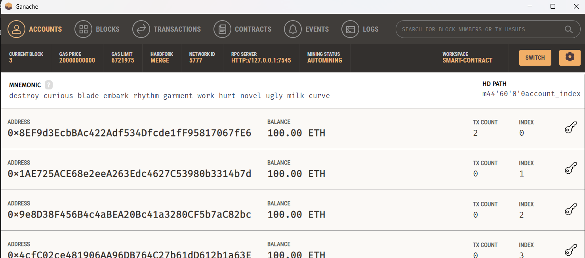
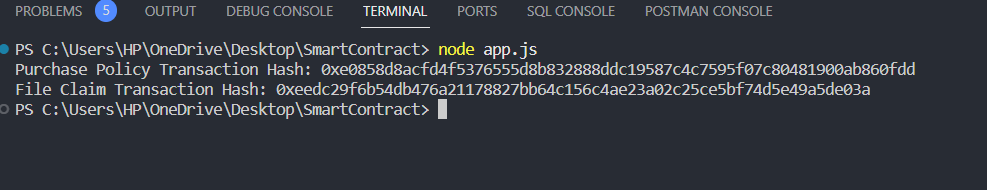
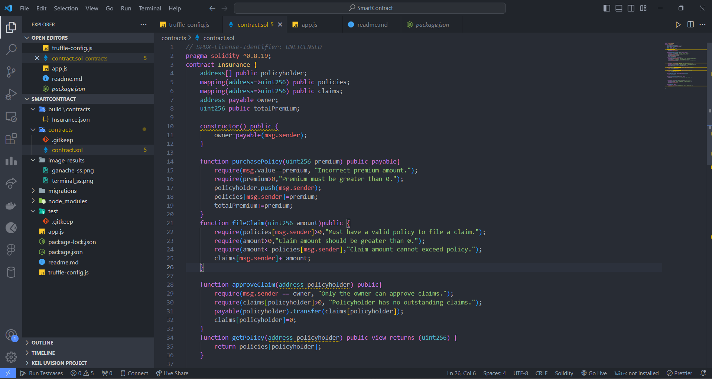

# Agriculture Crop Insurance Smart Contract

## Overview

This project implements a smart contract for managing agriculture crop insurance on the Ethereum blockchain. The smart contract allows farmers to purchase insurance policies, file claims, and receive insurance payouts.

## Smart Contract Features

### 1. Purchase Policy

Farmers can purchase insurance policies by providing a premium amount. The smart contract validates the premium and records the policy details, including the policyholder's address and premium amount.

### 2. File Claim

Policyholders can file insurance claims by specifying the claim amount. The smart contract validates the claim and processes the payout if the claim is valid.

### 3. Approve Claim

The contract owner, typically an insurance provider, has the authority to approve claims. Upon approval, the claimed amount is transferred to the policyholder.

### 4. Access Control

The smart contract has access control mechanisms to ensure that only the contract owner can approve claims. The owner can also grant or revoke access to specific addresses.

### 5. Destruction

The contract owner has the ability to destroy the contract when necessary.

## Getting Started

### Prerequisites

- Node.js and npm installed
- Truffle framework installed (`npm install -g truffle`)

### Installation

1. Clone the repository:

   ```bash
   git clone https://github.com/your-username/agriculture-crop-insurance.git
   cd agriculture-crop-insurance
2. Install Dependencies

    ```bash
    npm install
3. Complete and Migrate the Smart Contract

    ```bash
    truffle compile
    truffle migrate

### Usage
1. Run the development blockchain(Ganache)

    ```bash
    ganache-cli
2. Interact 

    ```bash
    node app.js

### Results
1.  

2.  

3.  

